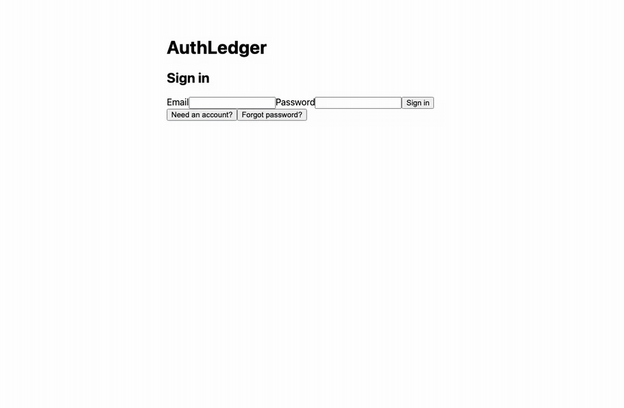
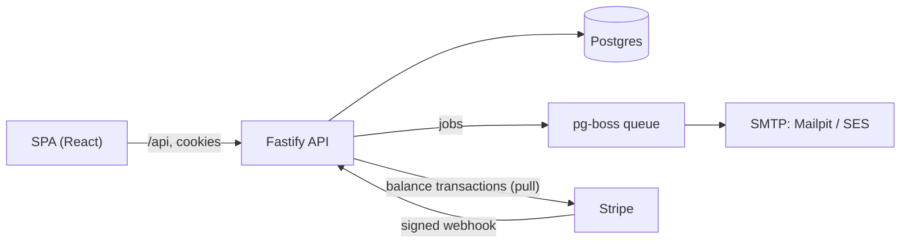
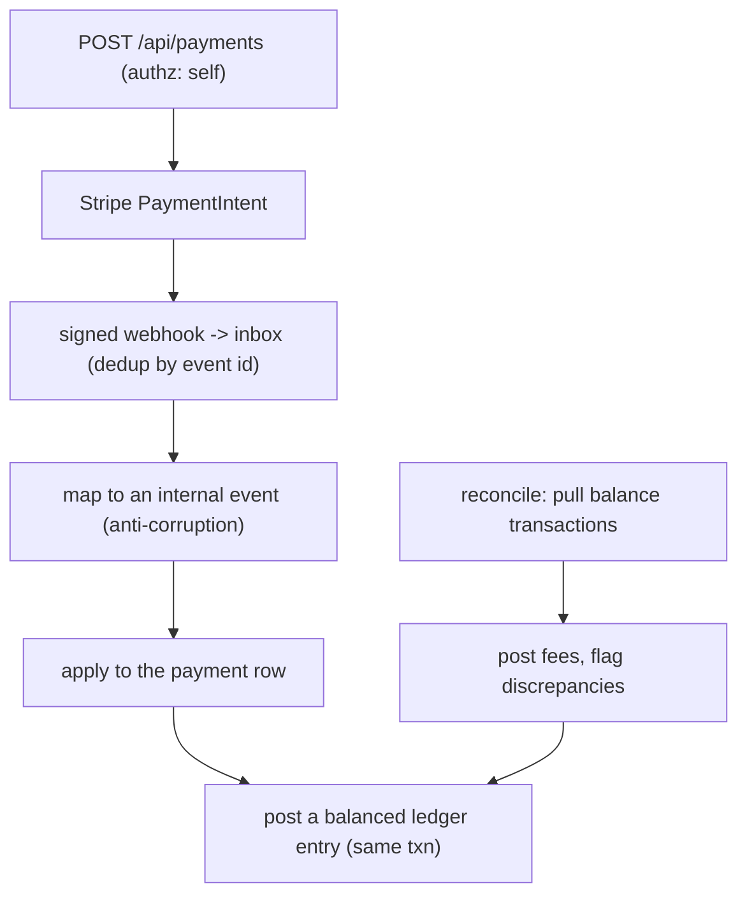

# AuthLedger

Identity and payments in one production-shaped system: an authentication and
authorization layer, and a Stripe-integrated payments domain with a double-entry
ledger and reconciliation. The two domains intersect on purpose. Authorization
decides who may initiate, view, refund, or reconcile a payment, so the money
endpoints are born gated.



A full screen-by-screen walkthrough with images is in
[docs/TOUR.md](docs/TOUR.md).

Every stack choice made while building is recorded in
[docs/RESEARCH.md](docs/RESEARCH.md).

## What it does

Identity:

- Registration, login, and logout over opaque server-side sessions (256-bit
  token, only its SHA-256 stored, HttpOnly SameSite=Lax cookie).
- argon2id passwords at OWASP parameters; session rotation on login; no
  wrong-password / unknown-email / locked oracle.
- Email verification, password reset, and security notifications over a
  pg-boss queue (Mailpit in dev, SES in production).
- TOTP MFA with AES-256-GCM-encrypted secrets, single-use recovery codes, and
  replay protection; the half-authenticated state is a short-lived challenge
  cookie, never a session.
- OAuth social login (Google via OIDC, GitHub via OAuth2) with CSRF-bound flows
  and conservative account linking.
- RBAC with a deny-by-default boot check: every route declares a policy, and
  the server refuses to start if one is missing.
- Audit log, per-route rate limits, account lockout, and active-session
  management.

Money:

- Stripe PaymentIntent creation with idempotency keys (ours and Stripe's), and
  a card checkout in the SPA using the Payment Element.
- A webhook inbox with signature verification, replay rejection, and
  out-of-order tolerance. Stripe stays behind an anti-corruption mapping layer,
  so the payment model and the ledger never see a Stripe type.
- Refunds with per-payment cumulative-ceiling tracking, so several partial
  refunds cannot be split around the ceiling.
- A double-entry ledger in integer minor units. The balance invariant (an
  entry's postings sum to zero) is a database constraint, and the ledger is
  append-only; a correction is a reversing entry.
- Reconciliation against Stripe balance transactions: fees are posted from
  them, and a settled charge missing from the ledger is flagged.

## Architecture

One origin serves the SPA and the API. In production CloudFront routes `/api/*`
to the service; in development the Vite dev server proxies `/api` to the API, so
the browser sees first-party cookies either way.



The payment-to-ledger pipeline, where the two domains meet:



Request-time authorization runs in one preHandler chain: the session cookie
resolves to `request.auth` with the caller's permissions, and each route is
`public`, `self`, or gated on a permission. A payment view, a refund, and a
reconciliation run each check a different rule; the money policy that a single
permission cannot express (ownership, amount ceilings) is a module of pure
functions.

## Stack

TypeScript on Node 24. Fastify v5 with `@sinclair/typebox` schemas at every
boundary (the OpenAPI document is their byproduct). Postgres 18 with the Kysely
query builder over SQL migrations (node-pg-migrate); query types are generated
from the live schema and committed, and CI fails on drift. Vite + React +
TanStack Query for the SPA. npm workspaces for `api`, `web`, and a `shared`
package of schemas. Terraform for two AWS stacks split by lifecycle.

## Layout

| Path      | Contents                                                       |
| --------- | -------------------------------------------------------------- |
| `api/`    | Fastify service: routes, domain logic, plugins, SQL migrations |
| `web/`    | Vite + React SPA and Playwright e2e                            |
| `shared/` | TypeBox schemas and types shared between api and web           |
| `infra/`  | Terraform: a persistent stack and an ephemeral stack           |
| `docs/`   | Research, tour, runbook, threat model, and data handling      |

## Running locally

Requirements: Node 24+, Docker with Compose.

```sh
make setup   # copy .env.example to .env, install, build the shared package
make dev     # start Postgres and Mailpit, then run api and web in watch mode
make seed    # migrate and insert the demo user (idempotent)
```

The API listens on 8000; the web dev server on 5173 proxies `/api` to it. In
development, Swagger UI is at `/api/docs` and Mailpit's inbox is at
`http://localhost:8025`. Migrations are plain SQL (`make migrate`) and query
types are regenerated with `make codegen`.

## Testing

```sh
make test        # api integration tests (real Postgres) and unit tests
npm run e2e -w web   # Playwright against the composed stack (api + built SPA + Postgres + Mailpit)
npm run typecheck && npm run lint
```

The api tests run against a real Postgres through Fastify's inject, so the HTTP
pipeline, validation, and SQL are all exercised. The e2e suite drives a real
browser through register, email verification, MFA login, and admin role
assignment.

## Trying a payment

Payments need a Stripe test-mode account. Put the test secret and publishable
keys in `.env` (`STRIPE_SECRET_KEY=sk_test_...`, `STRIPE_PUBLISHABLE_KEY=pk_test_...`);
the API refuses to boot with a non-test key outside production. Forward webhooks
with the Stripe CLI compose profile, which prints the signing secret to paste
into `STRIPE_WEBHOOK_SECRET`:

```sh
docker compose --profile stripe up -d stripe-cli
```

Then sign in, enter an amount, and pay with Stripe's test card
`4242 4242 4242 4242`. The webhook drives the payment to succeeded and posts the
charge to the ledger; a refund posts a reversing entry. No real money moves.


## Deploying

`infra/` holds two Terraform stacks split by lifecycle: a persistent stack (ECR,
the SPA bucket, the CloudFront distribution, the OIDC deploy role, secrets) that
idles at near-zero cost, and an ephemeral stack (VPC, ALB, ECS, RDS) that bills
by the hour and is stood up to prove a deploy, then torn down. GitHub Actions
runs CI on every push and drives standup, deploy, and teardown.

Backups in production are RDS automated snapshots. `make backup-drill` rehearses
the logical-dump path against the local database: it dumps Postgres, restores
into a throwaway database, and proves the copy matches by comparing the schema
and every table's row count.

## Documentation

- [docs/TOUR.md](docs/TOUR.md) - the app screen by screen, with images.
- [docs/OPERATIONS.md](docs/OPERATIONS.md) - the runbook: run, test, observe,
  deploy, recover.
- [docs/THREATMODEL.md](docs/THREATMODEL.md) - assets, trust boundaries, and
  mitigations mapped to the code that implements them.
- [docs/DATA.md](docs/DATA.md) - what is stored, why, and for how long.
- [docs/RESEARCH.md](docs/RESEARCH.md) - the stack research behind the picks.
